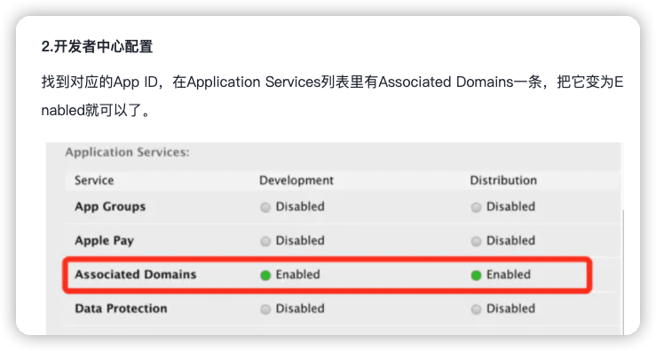
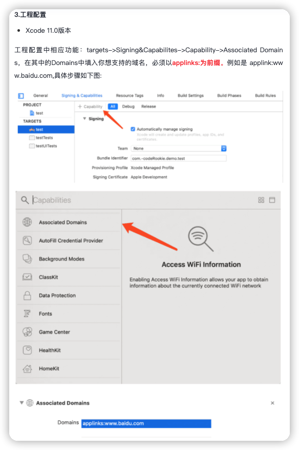

# fl_umeng_link

- 基于 fl_umeng 必须初始化友盟 `FlUMeng().init()`

- 插件已实现部分api，只需在友盟超链配置参数 和 在原生项目中配置部分配置信息

* android 配置 [具体参考官方文档](https://developer.umeng.com/docs/191212/detail/191230)

-`android/app/src/main/AndroidManifest.xml` 中添加以下内容

```xml

<manifest xmlns:android="http://schemas.android.com/apk/res/android" package="fl.umeng.link.example">
    <application>
        <activity android:name=".MainActivity" android:configChanges="orientation|keyboardHidden|keyboard|screenSize|smallestScreenSize|locale|layoutDirection|fontScale|screenLayout|density|uiMode" android:exported="true" android:hardwareAccelerated="true" android:launchMode="singleTop" android:theme="@style/LaunchTheme" android:windowSoftInputMode="adjustResize">
            <meta-data android:name="io.flutter.embedding.android.NormalTheme" android:resource="@style/NormalTheme" />

            <intent-filter>
                <action android:name="android.intent.action.MAIN" />
                <category android:name="android.intent.category.LAUNCHER" />
            </intent-filter>

            <!--    以下需要添加内容   -->
            <intent-filter>
                <action android:name="android.intent.action.VIEW" />

                <category android:name="android.intent.category.DEFAULT" />
                <category android:name="android.intent.category.BROWSABLE" />

                <!-- 替换为自己的scheme  -->
                <data android:scheme="wellyoung://" />
            </intent-filter>
            <!--    以上需要添加内容   -->
        </activity>
    </application>
</manifest>

```

* ios 配置 [具体参考官方文档](https://developer.umeng.com/docs/191212/detail/191260#h1--universal-link6)
    - 第一种方式 (scheme)
      配置 URL Types
    - 第二种方式 (Universal link)
      
      

## 开始使用

```dart
  Future<void> init() async {
  /// 注册友盟
  debugPrint('注册友盟');
  final bool? data = await FlUMeng().init(
      preInit: true,
      androidAppKey: '6248116b6adb343c47eff1a4',
      iosAppKey: '6203785ce014255fcb18fcad',
      channel: 'channel');
  debugPrint('Umeng 初始化成功 = $data');
  await FlUMeng().setLogEnabled(true);

  debugPrint('监听友盟超链安装参数回调');
  final bool? value = await FlUMengLink().getInstallParams();
  debugPrint('getInstallParams 初始化成功 = $value');

  final bool handler =
  FlUMengLink().addMethodCallHandler(onInstall: (UMLinkResult? result) {
    text = 'onInstall\n${result?.toMap()}';
    setState(() {});
  }, onLink: (UMLinkResult? result) {
    text = 'onLink\n${result?.toMap()}';
    setState(() {});
  }, onError: (String? error) {
    text = 'onError\n$error';
    setState(() {});
  });
  debugPrint('addMethodCallHandler 初始化成功 = $handler');
}
```